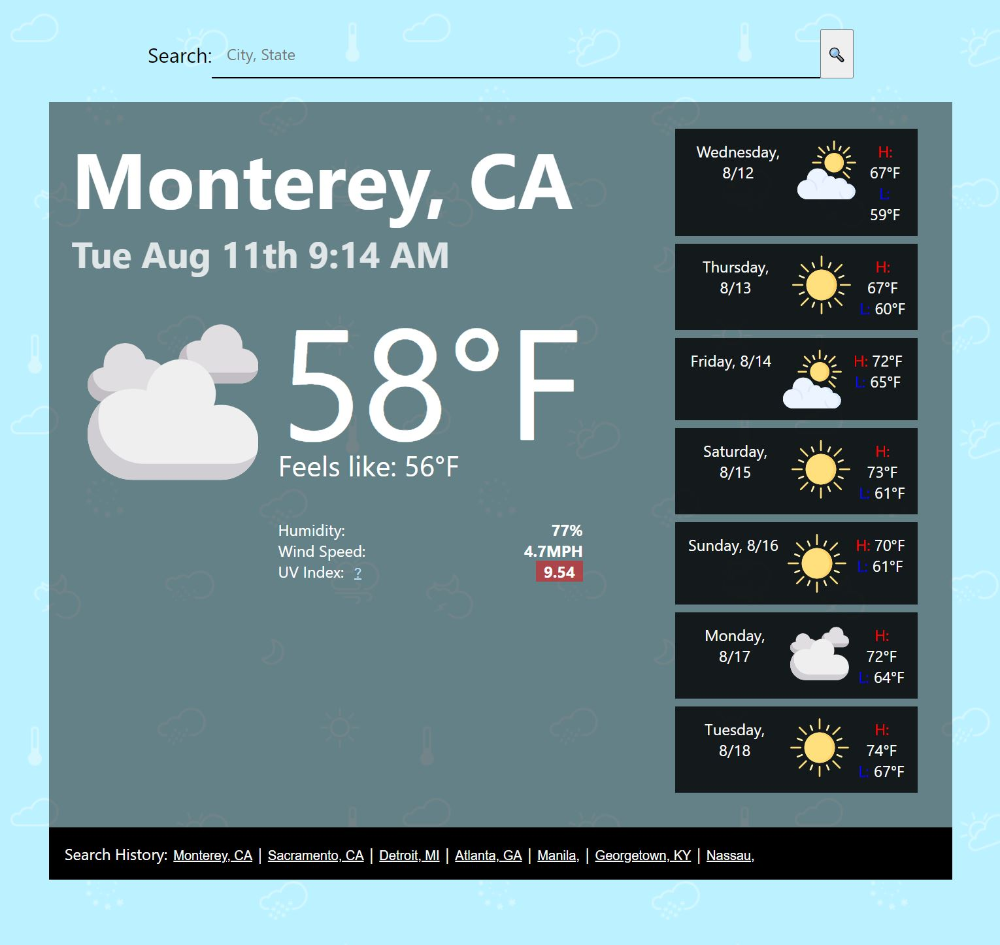
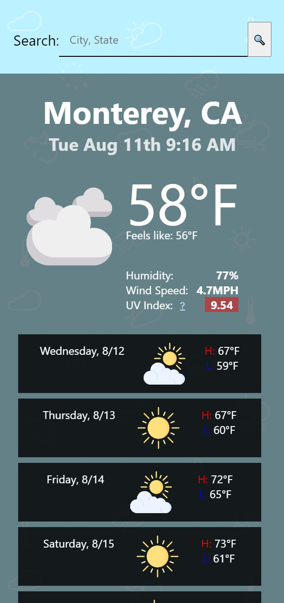

# Weather by GV

> Full-stack web application for searching cities and displaying their weather data.

## [Check the weather!](https://bit.ly/31aTaNS)

## Description

Using the search field on top of the page a user can search for a city and is presented with current and future conditions for that city. That city is then added to the search history below. Clicking an old search term will pull current and future conditions for that city.

"As a frequent traveler I want to be able to find weather information for cities I visit so that I can be better prepared for Mother Nature"

Available Data:

- Local Time
- Weather Icon (of conditions)
- The current temperature, humidity, wind speed, and UV Index.
- UV Index is color-coded indicating the conditions favorability. Per EPA's [UV Index](https://www.epa.gov/sunsafety/uv-index-scale-0)
- 7 Day forecast displaying temperature Highs and Lows, humidity, and weather icon.

### And responsive!

## Planned updates

I hope to turn it into a Progressive Web Application in the near future to add offline functionality among other things.

- Dark Mode
- Favicon
- Images per city searched
- Animations
